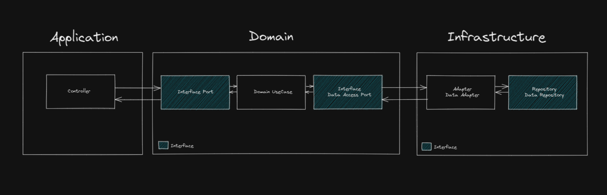

# Controle de Entradas & Saídas

Este projeto, tem o intuito de facilitar a vida do empreendedor, deixando disponível informações que auxiliam no gerenciamento do seu negócio.

## 🚀 Começando

Essas instruções permitirão que você obtenha uma cópia do projeto em operação na sua máquina local para fins de desenvolvimento e teste.

Consulte **[Implantação](#-implanta%C3%A7%C3%A3o)** para saber como implantar o projeto.

### 📋 Pré-requisitos

Para utilização do serviço em ambiente local, você precisará das seguintes ferramentas.

```
- Java
- Docker
- IDE (IntelliJ ou Eclipse)
```

### 🔧 Instalação

Uma série de exemplos passo-a-passo que informam o que você deve executar para ter um ambiente de desenvolvimento em execução.

Diga como essa etapa será:

```
Dar exemplos
```

E repita:

```
Até finalizar
```

Termine com um exemplo de como obter dados do sistema ou como usá-los para uma pequena demonstração.

### ⌨️ Arquitetura



```
Dar exemplos
```

## 🛠️ Construído com

* [Kotlin](http://www.dropwizard.io/1.0.2/docs/) - Linguagem utilizada
* [Ecossistema Spring](http://www.dropwizard.io/1.0.2/docs/) - O framework web usado
* [Spring Security](http://www.dropwizard.io/1.0.2/docs/) - Framework para segurança
* [Spring Data](http://www.dropwizard.io/1.0.2/docs/) - Framework para manipulação de dados
* [Gradle](https://maven.apache.org/) - Gerente de Dependência
* [MySQL](https://maven.apache.org/) - Banco de dados utilizado

## 📦 Implantação

Será utilizado docker...

## 📌 Versão

Nós usamos [SemVer](http://semver.org/) para controle de versão. Para as versões disponíveis, observe as [tags neste repositório](https://github.com/suas/tags/do/projeto). 

Desenvolvido por [Hugo Brendow](https://github.com/hugobrendow)